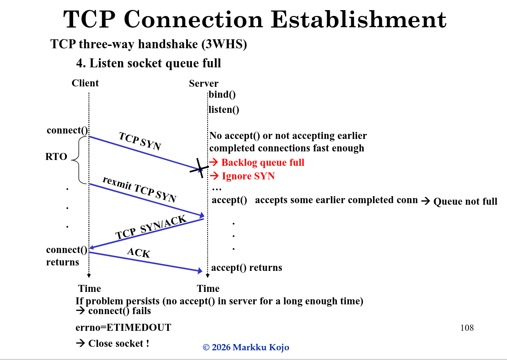
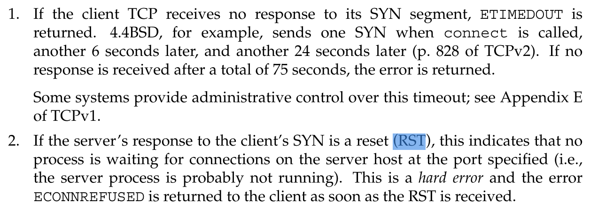
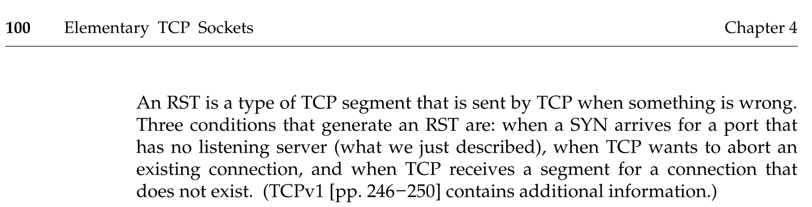

# task 3

skipped

# task 4

skipped

# task 5

As seen in the below slide `SYN` simply gets ignored on the **server side**, and the application will never know about it. There might be an `RST` sent back to the client.

The **client side** the TCP layer expects `SYN+ACK` response within N seconds (e.g. 24 in 4.4BSD), if it does not arrive, it sends another `SYN` request and repeats the process several times.
The app will experience this as the call to `connect()` failing with `errno == ETIMEDOUT`, or `errno == ECONNREFUSED` in case and `RST` was sent back. It has no way of knowing why the `SYN+ACK` never arrived back, other probable reason might be simple packet loss.

