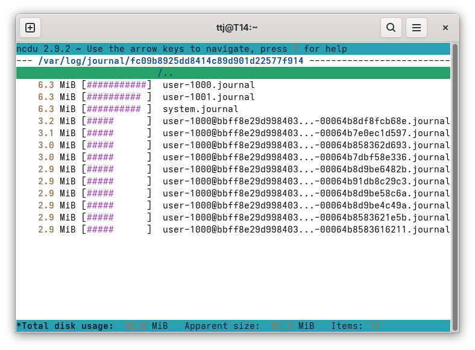

# 1

After receiving the 1st UDP datagram, the **Server sends back an ICMP error**, because nothing is listening on the port in question.

In case the Client called `connect()` on the socket, it can make calls to `write` and `read`.
The kernel, locally associates the returning ICMP error to the app and delivers it on next invokation (e.g. write operation fails).

In case the Client did not call connect, it does not see failure as the kernel ignores those ICMP erros, I simply got no echoes in my program.

# 2&3 Unix system logging

System logs on my laptop (sysmted-based) are located in `/var/log/journal/<hash>` and are not forwarded to any server:


These logs are appended to in a structured manner - retaining timestamps, PIDs and other descriptive information - and can quickly grow to gigabytes in size in case you have a driver issue, or some installed package starts logging verbosely after an update.

I could trim them with one of the following:

```sh
journalctl --vacuum-size=10M
journalctl --vacuum-time=2weeks
```

But I already have an override in place, that keeps them compact sized:

```sh
$ cat /etc/systemd/journald.conf.d/00-journal-size.conf
[Journal]
SystemMaxUse=50M
```

The command `journalctl -t h6t2 -f` follows the output of this [small app](./t2.c) that makes delayed calls to syslog with different priorities. The `-p N` or `-p N..N` args to journalctl filter lines based on these priorities.

From the [man page](https://man7.org/linux/man-pages/man3/syslog.3.html) we can see the whole list of priorities.

# 6 Course feedback

It was interesting to see how signal handling, spawning child processes and IPC work in C.

The name of the course is misleading: "C programming" would describe it better.
The workload is somewhat misaligned with other 5cr. courses
(take the Haskell course for reference, which can be completed under a week)
at the University of Helsinki and would greatly benefit from being moved to MOOC:

- lecture slides (in PowerPoint form factor)
  contain massive amounts of custom formatted source code
  spanning several slides with the occasional syntax error

- showing model solutions after submission of the weekly tasks online
  would be more efficient, than having obligatory gatherings in Kumpula

- modernize the material
  - skip and remove function definitions,
    that became standardized over the past 20+ years
  - remove unnecessary casts
    throughout the source code snippets in the lecture slides

- abolish the **pen & paper "programming"** exam
  - or provide cheatsheets on paper with the
    docstrings and signatures of the required functions
    (there is a reason why IDEs are wide-spread :)
